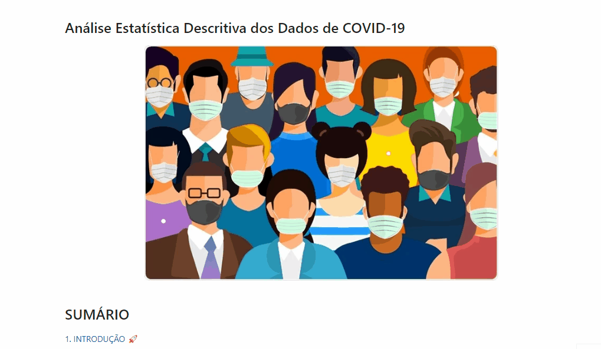
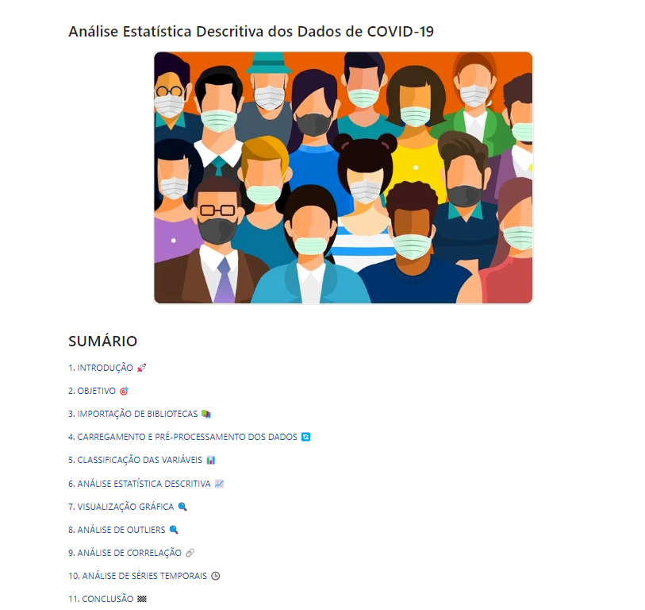
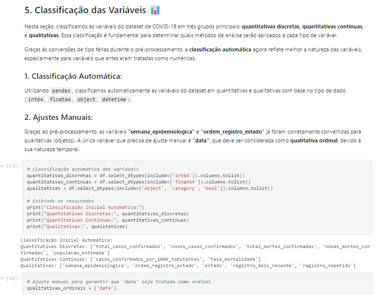
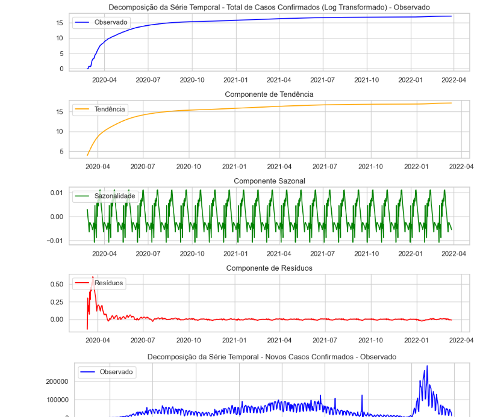

# 🦠  Análise Estatística e Temporal da COVID-19

## 📝 Descrição do Projeto  
Este projeto faz parte do módulo de **Estatística** do **Santander Coders 2024**, desenvolvido com o objetivo de aplicar técnicas de **análise estatística descritiva** e **análise de séries temporais** para entender a evolução dos casos de **COVID-19 no Brasil**. O projeto explora um dataset real de COVID-19, disponível publicamente, e foca em duas abordagens principais:

1. **Análise Estatística Descritiva**: Entendimento das variáveis envolvidas e identificação de padrões, outliers e correlações.
2. **Análise de Séries Temporais**: Estudo da evolução dos casos confirmados e novos casos ao longo do tempo, com decomposição das séries para extrair componentes de tendência, sazonalidade e resíduos.

O projeto exemplifica o uso de ferramentas como **Pandas**, **Matplotlib** e **Seaborn** para realizar análises estatísticas e visualizações que ajudam a capturar a dinâmica da pandemia no Brasil, desde o início até o final de 2022.

  

## 🗂️ Estrutura do Repositório
Este repositório está organizado da seguinte forma:
- **01_Base_de_Dados**: Contém os arquivos de dados brutos utilizados para análise, incluindo detalhes de faturamento, clientes e equipamentos.
- **02_Dashboard**: Contém o arquivo do dashboard em Excel, pronto para uso.
- **03_Recursos**: Contém recursos utilizados no projeto.

## 🔍 Estrutura do Projeto

### Parte 1: Análise Estatística Descritiva
- **Distribuição de Casos e Mortes Confirmadas**: Análise da assimetria das distribuições de casos e mortes, bem como a presença de outliers significativos.
- **Correlação Entre Variáveis**: Análise da correlação entre o total de casos confirmados e o total de mortes confirmadas, e a correlação com a população estimada por estado.
- **Identificação de Outliers**: Investigação dos períodos com surtos intensos de COVID-19 e como eles influenciaram o comportamento geral da pandemia.

### Parte 2: Análise de Séries Temporais
- **Comportamento Temporal**: Análise do crescimento exponencial de casos confirmados, seguida de estabilização no final de 2022.
- **Decomposição da Série Temporal**: Estudo dos componentes de tendência, sazonalidade e resíduos, tanto para o total de casos confirmados quanto para os novos casos diários.
- **Verificação de Estacionariedade**: Aplicação de testes de estacionariedade e transformações para garantir que as séries possam ser utilizadas em análises preditivas, como o uso da transformação logarítmica.
- **Análise de Resíduos**: Verificação da normalidade dos resíduos para identificar se há fatores não capturados que impactaram a propagação da doença.

## 💾 Demonstração e Uso
Para explorar a análise, você pode seguir uma das opções abaixo:

1. **Visualização Direta no GitHub**:
   - Vá até a pasta **02-Analise** e abra o arquivo **Jupyter Notebook** diretamente no GitHub para visualizar a análise sem precisar baixar.
   - [Clique aqui para acessar a pasta de análise](02-Analise/covid19-brazil-analysis.ipynb).

2. **Download do Notebook**:
   - Caso a visualização no GitHub não funcione adequadamente ou prefira trabalhar localmente, você pode baixar o arquivo que está no caminho anterior.

3. **Instruções de Uso Local**:
   - Após baixar, abra o notebook no Jupyter ou em uma plataforma que suporte notebooks IPython.
   - Execute as células sequencialmente para visualizar as análises e gráficos.

## 🛠️ Tecnologias Utilizadas
- [Python](https://www.python.org/)
- [Jupyter Notebook](https://jupyter.org/)
- [Pandas](https://pandas.pydata.org/)
- [Matplotlib](https://matplotlib.org/)
- [Seaborn](https://seaborn.pydata.org/)

## 🏗️ Arquitetura e Fluxo de Análise

O fluxo de análise no projeto segue a seguinte estrutura:

1. **Coleta de Dados**: Dados abertos de COVID-19 no Brasil, com informações diárias de casos confirmados e mortes por estado.
2. **Manipulação e Limpeza de Dados**: Utilizamos a biblioteca Pandas para limpar, formatar e preparar os dados, removendo valores inconsistentes e tratando dados ausentes.
3. **Visualização Gráfica**: Criamos gráficos descritivos e temporais utilizando Matplotlib e Seaborn para ilustrar as tendências e padrões presentes no dataset.
4. **Decomposição e Estacionariedade**: Verificamos a tendência e a sazonalidade das séries temporais, além de aplicar transformações como log para garantir a estacionariedade.

## 📈 Impacto e Resultados

- **Análise Detalhada da Pandemia**: O projeto permitiu uma visualização clara do comportamento da COVID-19 no Brasil ao longo do tempo, com insights sobre surtos e períodos de estabilização.
- **Compreensão de Surtos**: Através da análise de séries temporais, conseguimos identificar os principais momentos críticos da pandemia, além de avaliar as variações sazonais no número de novos casos.
- **Validação de Conhecimentos em Estatística**: Aplicamos técnicas estatísticas fundamentais para validar hipóteses e entender a evolução da pandemia, demonstrando o aprendizado adquirido ao longo do curso.

## 🖼️ Screenshots
Aqui estão algumas capturas de tela das análises:

## 📞 Contato
- 📫 Você pode entrar em contato comigo pelo meu [e-mail](mailto:thiago.leit@hotmail.com).
- 💼 Meu perfil no [LinkedIn](https://www.linkedin.com/in/tnleite/) para acompanhar meu progresso e projetos.
- ✍🏻 Meu perfil no [Medium](https://medium.com/@thiago.leit) para ver artigos publicados.
- 🌐 Meu [Portfólio](https://thiagoleitedata.com.br) para visualizar outros projetos.

